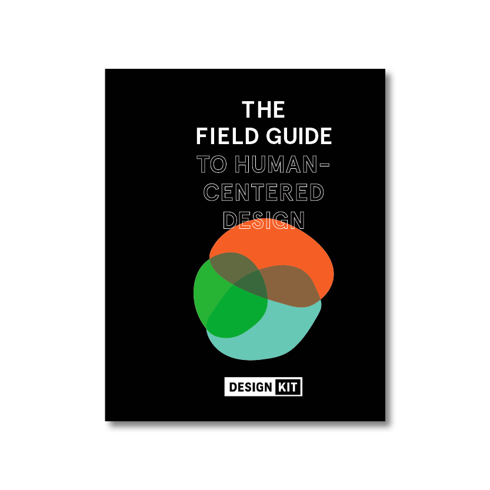
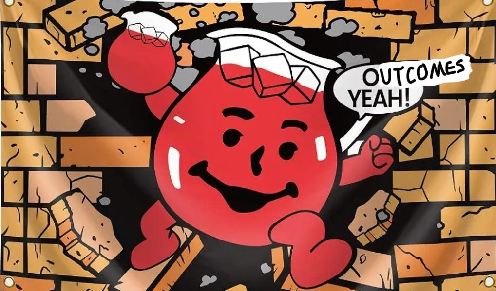
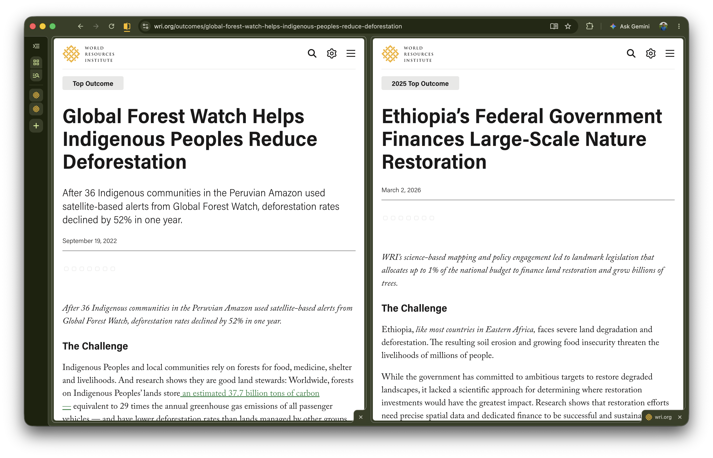
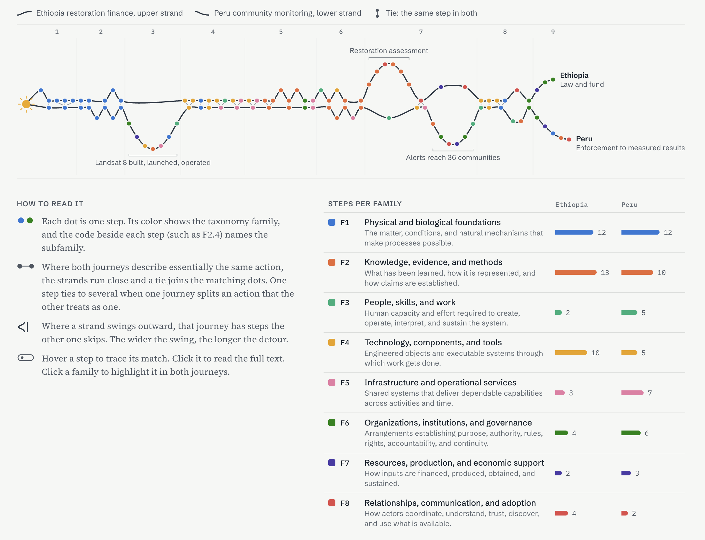
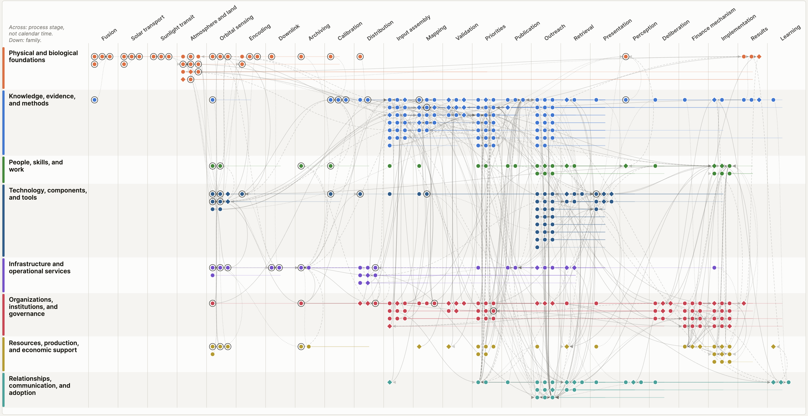
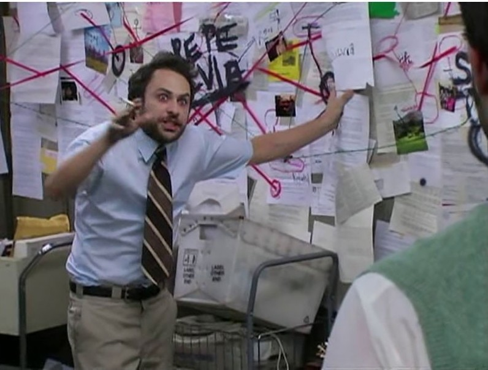
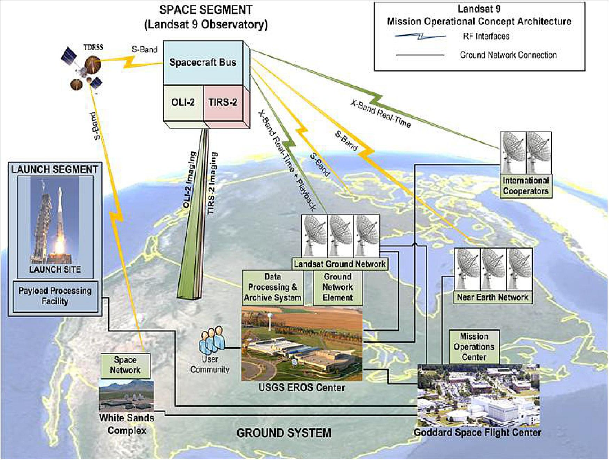
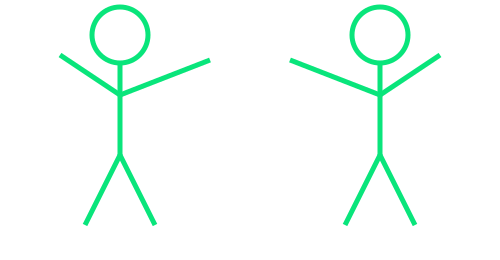

## {#slide-1 background-color="#0a0a0a" data-menu-title="Last miles in geo"}

[Last miles in geo]{.headline .slide-top}

::: {.collage-01}
<div class="photo-card a-pop" style="left:120px; top:175px; width:470px; --rot:-5deg; --d:0.2s"></div>
<div class="photo-card a-pop" style="left:660px; top:205px; width:300px; --rot:4deg; --d:0.9s"></div>
<div class="photo-card a-pop" style="left:1040px; top:160px; width:340px; --rot:-3deg; --d:1.6s"></div>
<div class="photo-card a-pop" style="left:380px; top:520px; width:440px; --rot:3deg; --d:2.3s"></div>
:::

<div class="photo-card photo-late a-pop" style="left:890px; top:420px; width:580px; --rot:3deg; --d:9s"></div>
<div class="photo-card photo-late a-pop" style="left:150px; top:360px; width:560px; --rot:-4deg; --d:11.5s"></div>


## {#slide-2 background-color="#0a0a0a" data-menu-title="Outcomes"}

::: {.center-v}
[At WRI, our last mile is [outcomes]{.green}]{.headline}

{.img-hero width=1060 fig-alt="Kool-Aid Man bursting through a wall shouting 'Outcomes, yeah!'"}
:::


## {#slide-3 background-color="#0a0a0a" data-menu-title="What outcomes require"}

::: {.center-v}
::: {.criteria}
[Outcomes require]{.kicker}

[[Relevance]{.term} [Is the intervention doing the right thing?]{.question}]{.criterion .a-rise style="--d:0.3s"}

[[Effectiveness and scale]{.term} [Is the intervention achieving its objectives?]{.question}]{.criterion .a-rise style="--d:0.9s"}

[[Contribution and collaboration]{.term} [What role did the work play in the outcome?]{.question}]{.criterion .a-rise style="--d:1.5s"}
:::
:::


## {#slide-4 background-color="#0a0a0a" data-menu-title="Two examples"}

::: {.center-v}
[Example]{.kicker}

[Alerts in Loreto, Peru [&]{.dim} a restoration program in Ethiopia]{.headline .headline-sm}

{.img-hero width=1080 fig-alt="Two WRI outcome pages: Global Forest Watch helps Indigenous Peoples reduce deforestation, and Ethiopia's federal government finances large-scale nature restoration"}
:::


## {#slide-5 background-image="images/Peru.jpg" background-size="cover" background-position="center" data-menu-title="Loreto, Peru"}

::: {.shade-bottom}
:::

::: {.photo-caption}
[Loreto, Peru]{.caption-title}

[36 Indigenous communities used Global Forest Watch alerts. Deforestation fell 52% in one year.]{.caption-sub}
:::


## {#slide-6 background-image="images/Ethiopia.png" background-size="cover" background-position="center" data-menu-title="Ethiopia"}

::: {.shade-bottom}
:::

::: {.photo-caption}
[Ethiopia]{.caption-title}

[Science-based restoration mapping led to a law that puts up to 1% of the national budget toward land restoration.]{.caption-sub}
:::


## {#slide-7 background-color="#0a0a0a" data-menu-title="Contribution details"}

::: {.center-v}
::: {.text-block}
[Contribution details]{.kicker}

[Our involvement may be considered a contribution if:]{.lead}

- the outcome would not have been achieved without us
- involvement positively altered the nature of the change
- involvement caused the change to occur more quickly
- we created the intervention or project that led to the outcome
:::
:::


## {#slide-8 background-color="#0a0a0a" data-menu-title="A vast universe of contributors"}

::: {.center-v}
[A vast universe of contributors!]{.statement}

[We need a reasonable assessment boundary.]{.statement-sub .green .a-rise style="--d:2.5s"}
:::


## {#slide-9 background-color="#0a0a0a" data-menu-title="Start at the Sun"}

```{=html}
<div class="sun-scene">
  <canvas class="sun-walk"></canvas>
  <div class="sun-copy">
    <p class="kicker">Start at the Sun</p>
    <p class="years"><span class="years-count">0</span> years</p>
    <p class="years-range a-fade" style="--d:12.4s">(10k–170k)</p>
    <p class="sun-note">for energy from fusion in the core to random&#8209;walk its way to the surface</p>
  </div>
</div>
```


## {#slide-10 background-color="#0a0a0a" data-menu-title="Sun to Earth"}

```{=html}
<svg class="photon-trip" viewBox="0 0 1600 900" aria-label="A photon travels from the Sun to Earth in 8 minutes 20 seconds">
  <defs>
    <radialGradient id="sun-fill" cx="0.5" cy="0.5" r="0.5">
      <stop offset="0" stop-color="#ffe7a3"/>
      <stop offset="0.7" stop-color="#ffb638"/>
      <stop offset="1" stop-color="#f07a1f"/>
    </radialGradient>
    <filter id="soft-glow" x="-50%" y="-50%" width="200%" height="200%">
      <feGaussianBlur stdDeviation="6" result="b"/>
      <feMerge><feMergeNode in="b"/><feMergeNode in="SourceGraphic"/></feMerge>
    </filter>
    <filter id="halo" x="-50%" y="-50%" width="200%" height="200%">
      <feGaussianBlur stdDeviation="40"/>
    </filter>
  </defs>

  <!-- Sun -->
  <circle cx="-260" cy="450" r="600" fill="#ffb638" opacity="0.35" filter="url(#halo)"/>
  <circle cx="-260" cy="450" r="560" fill="url(#sun-fill)"/>

  <!-- Earth -->
  <circle class="earth-glow" cx="1340" cy="450" r="110" fill="#09e57b" filter="url(#halo)"/>
  <g class="earth" stroke="#09e57b" stroke-width="4" fill="none">
    <circle cx="1340" cy="450" r="72" fill="rgba(9,229,123,0.1)"/>
    <ellipse cx="1340" cy="450" rx="30" ry="72"/>
    <line x1="1268" y1="450" x2="1412" y2="450"/>
    <path d="M1280 414 Q1340 426 1400 414"/>
    <path d="M1280 486 Q1340 474 1400 486"/>
  </g>

  <!-- Photon -->
  <path class="photon-trail" pathLength="1000" fill="none" stroke="#ffb638" stroke-width="3" stroke-linecap="round"
        d="M303 450 q15 -16 30 0 t30 0 t30 0 t30 0 t30 0 t30 0 t30 0 t30 0 t30 0 t30 0 t30 0 t30 0 t30 0 t30 0 t30 0 t30 0 t30 0 t30 0 t30 0 t30 0 t30 0 t30 0 t30 0 t30 0 t30 0 t30 0 t30 0 t30 0 t30 0 t30 0 t30 0 t30 0"/>
  <path class="photon-head" pathLength="1000" fill="none" stroke="#fff6d8" stroke-width="7" stroke-linecap="round" filter="url(#soft-glow)"
        d="M303 450 q15 -16 30 0 t30 0 t30 0 t30 0 t30 0 t30 0 t30 0 t30 0 t30 0 t30 0 t30 0 t30 0 t30 0 t30 0 t30 0 t30 0 t30 0 t30 0 t30 0 t30 0 t30 0 t30 0 t30 0 t30 0 t30 0 t30 0 t30 0 t30 0 t30 0 t30 0 t30 0 t30 0"/>
</svg>
<p class="trip-time a-fade" style="--d:1.2s">8 min 20 s · 93 million miles</p>
<p class="trip-punch statement a-rise" style="--d:5s">Everything else is the <span class="green">last mile</span>.</p>
```


## {#slide-11 background-color="#0a0a0a" data-menu-title="Feed the robot"}

```{=html}
<svg class="robot-scene" viewBox="0 0 1400 640" aria-label="A person feeds documents to a robot, the robot asks a question, the person answers">
  <g stroke="#09e57b" stroke-width="5" fill="none" stroke-linecap="round" stroke-linejoin="round">
    <!-- Person -->
    <circle cx="150" cy="300" r="34"/>
    <line x1="150" y1="334" x2="150" y2="450"/>
    <line x1="150" y1="370" x2="215" y2="345"/>
    <line x1="150" y1="370" x2="95" y2="410"/>
    <line x1="150" y1="450" x2="115" y2="540"/>
    <line x1="150" y1="450" x2="185" y2="540"/>

    <!-- Robot -->
    <line x1="1010" y1="80" x2="1010" y2="130"/>
    <circle class="antenna" cx="1010" cy="66" r="13" fill="#09e57b"/>
    <rect x="870" y="130" width="280" height="150" rx="26" fill="rgba(9,229,123,0.08)"/>
    <circle cx="960" cy="200" r="18" fill="#09e57b"/>
    <circle cx="1060" cy="200" r="18" fill="#09e57b"/>
    <rect x="900" y="278" width="220" height="62" rx="10" fill="#0a0a0a" stroke-width="3" stroke-opacity="0.5"/>
    <g class="jaw">
      <rect x="890" y="284" width="240" height="60" rx="14" fill="#0a0a0a"/>
      <line x1="935" y1="284" x2="935" y2="300"/>
      <line x1="985" y1="284" x2="985" y2="300"/>
      <line x1="1035" y1="284" x2="1035" y2="300"/>
      <line x1="1085" y1="284" x2="1085" y2="300"/>
    </g>
    <rect x="980" y="344" width="60" height="26"/>
    <rect x="890" y="370" width="240" height="190" rx="22" fill="rgba(9,229,123,0.08)"/>
    <circle cx="1010" cy="440" r="24"/>
    <line x1="950" y1="505" x2="1070" y2="505"/>
    <line x1="890" y1="410" x2="830" y2="495"/>
    <line x1="1130" y1="410" x2="1190" y2="495"/>
  </g>

  <!-- Documents: outer group positions, inner group animates -->
  <g transform="translate(205 290)"><g class="doc" style="--d:0.4s"><use href="#doc-shape"/></g></g>
  <g transform="translate(205 270)"><g class="doc" style="--d:1.3s"><use href="#doc-shape"/></g></g>
  <g transform="translate(205 300)"><g class="doc" style="--d:2.2s"><use href="#doc-shape"/></g></g>
  <g transform="translate(205 280)"><g class="doc" style="--d:3.1s"><use href="#doc-shape"/></g></g>
  <g transform="translate(205 290)"><g class="doc" style="--d:4s"><use href="#doc-shape"/></g></g>
  <defs>
    <g id="doc-shape" stroke="#fafafa" stroke-width="3" fill="none" stroke-linejoin="round">
      <path d="M0 0 H58 L80 22 V104 H0 Z" fill="#1a1a1a"/>
      <path d="M58 0 V22 H80"/>
      <line x1="14" y1="40" x2="66" y2="40"/>
      <line x1="14" y1="56" x2="66" y2="56"/>
      <line x1="14" y1="72" x2="66" y2="72"/>
      <line x1="14" y1="88" x2="46" y2="88"/>
    </g>
  </defs>

  <!-- Robot asks -->
  <g class="bubble a-pop" style="--d:6s">
    <path d="M1180 40 H1350 Q1370 40 1370 60 V150 Q1370 170 1350 170 H1215 L1170 205 L1185 170 Q1180 170 1180 150 Z"
          fill="rgba(9,229,123,0.1)" stroke="#09e57b" stroke-width="4"/>
    <text class="q-mark" x="1275" y="135" text-anchor="middle">?</text>
    <text class="bang" x="1275" y="135" text-anchor="middle">!</text>
  </g>

  <!-- Person answers -->
  <g class="bubble a-pop" style="--d:8s">
    <path d="M230 110 H560 Q580 110 580 130 V210 Q580 230 560 230 H250 L205 262 L222 230 Q210 230 210 210 V130 Q210 110 230 110 Z"
          fill="rgba(250,250,250,0.06)" stroke="#fafafa" stroke-width="4"/>
    <g stroke="#fafafa" stroke-width="6" stroke-linecap="round">
      <path class="answer-line" style="--d:8.5s" pathLength="1" d="M250 145 H540"/>
      <path class="answer-line" style="--d:9s" pathLength="1" d="M250 172 H520"/>
      <path class="answer-line" style="--d:9.5s" pathLength="1" d="M250 199 H440"/>
    </g>
  </g>
</svg>
<p class="robot-caption a-fade" style="--d:0.2s">Feed the robot some context, answer some questions…</p>
```


## {#slide-12 background-color="#0a0a0a" data-menu-title="One sequence per outcome"}

::: {.center-v}
[One sequence per outcome, and how they sync up]{.headline .headline-sm}

::: {.crop-card .chain-crop}
{fig-alt="Two strands of colored dots, one per step, tracing the Ethiopia and Peru outcome journeys from the Sun to the result"}
:::
:::


## {#slide-13 background-color="#0a0a0a" data-menu-title="Dig deeper"}

[Dig deeper: find the dependencies, lean into the taxonomy]{.headline .headline-sm .slide-top}

```{=html}
<div class="dep-layout">
  <svg class="dep-graph" viewBox="0 0 700 360" aria-label="Dependency graph: A depends on B and C, B depends on D">
    <g stroke="#09e57b" stroke-width="4" fill="none">
      <path class="dep-edge" style="--d:0.4s" pathLength="1" d="M584 168 L392.7 78"/>
      <path class="dep-edge" style="--d:1s" pathLength="1" d="M296 60 L126 60"/>
      <path class="dep-edge" style="--d:1.6s" pathLength="1" d="M584 196 L392.8 280.3"/>
    </g>
    <g fill="#09e57b">
      <path class="a-fade" style="--d:0.85s" d="M380 72 L400.1 71.5 L392.5 87.8 Z"/>
      <path class="a-fade" style="--d:1.45s" d="M112 60 L130 51 L130 69 Z"/>
      <path class="a-fade" style="--d:2.05s" d="M380 286 L392.8 270.5 L400.1 287 Z"/>
    </g>
    <g class="dep-nodes" stroke="#09e57b" stroke-width="4" fill="rgba(9,229,123,0.08)">
      <circle cx="70" cy="60" r="42"/>
      <circle cx="338" cy="60" r="42"/>
      <circle cx="624" cy="182" r="42"/>
      <circle cx="338" cy="300" r="42"/>
    </g>
    <g class="dep-labels" text-anchor="middle">
      <text x="70" y="72">D</text>
      <text x="338" y="72">B</text>
      <text x="624" y="194">A</text>
      <text x="338" y="312">C</text>
    </g>
  </svg>
  <ul class="families">
    <li class="a-rise" style="--c:#4a7fd8; --d:2.2s"><b>F1</b> Physical and biological foundations</li>
    <li class="a-rise" style="--c:#e07040; --d:2.6s"><b>F2</b> Knowledge, evidence, and methods</li>
    <li class="a-rise" style="--c:#5bb58a; --d:3.0s"><b>F3</b> People, skills, and work</li>
    <li class="a-rise" style="--c:#e3a83a; --d:3.4s"><b>F4</b> Technology, components, and tools</li>
    <li class="a-rise" style="--c:#e088a8; --d:3.8s"><b>F5</b> Infrastructure and operational services</li>
    <li class="a-rise" style="--c:#4f9a35; --d:4.2s"><b>F6</b> Organizations, institutions, and governance</li>
    <li class="a-rise" style="--c:#7a6ad6; --d:4.6s"><b>F7</b> Resources, production, and economic support</li>
    <li class="a-rise" style="--c:#e0595a; --d:5.0s"><b>F8</b> Relationships, communication, and adoption</li>
  </ul>
</div>
```


## {#slide-14 background-color="#0a0a0a" data-menu-title="A web of dependencies"}

::: {.center-v}
[A web of dependencies]{.headline .headline-sm}

::: {.crop-card .web-card .kenburns}
{fig-alt="Dense matrix of steps by process stage and taxonomy family, with hundreds of dependency links between them"}
:::
:::


## {#slide-15 background-color="#0a0a0a" data-menu-title="It's all connected"}

::: {.center-v}
{.img-hero height=680 fig-alt="Man frantically pointing at a wall of papers connected by red string"}

[It's all connected, man.]{.headline .headline-sm}
:::


## {#slide-16 background-color="#0a0a0a" data-menu-title="From orbit to catalog"}

::: {.center-v}
{.img-hero .img-framed height=690 fig-alt="Landsat 9 mission operational concept: space segment, launch segment, ground network, and data processing"}

[From orbit to catalog, again and again.]{.headline .headline-sm}
:::


## {#slide-17 background-image="images/deep-field.jpg" background-size="cover" background-position="center" data-menu-title="In each of these steps"}

::: {.deep-shade}
:::

::: {.center-v .deep-copy}
[In each of these steps:]{.statement-sub .a-fade style="--d:0.3s"}

[a universe]{.statement .a-rise style="--d:2s"}

[a history]{.statement .a-rise style="--d:4s"}

[an ecosystem]{.statement .a-rise style="--d:6s"}

[… load-bearing]{.statement .green .a-rise style="--d:8.5s"}
:::


## {#slide-18 background-color="#0a0a0a" data-menu-title="Research to published data"}

```{=html}
<svg class="pipeline" viewBox="0 0 1500 420" aria-label="Research, then develop a model or algorithm, then compute, then publish data">
  <defs>
    <marker id="pipe-arrow" viewBox="0 0 10 10" refX="9" refY="5" markerWidth="5" markerHeight="5" orient="auto">
      <path d="M 0 0 L 10 5 L 0 10 z" fill="#09e57b"/>
    </marker>
  </defs>

  <!-- Arrows + moving pulses -->
  <g stroke="#09e57b" stroke-width="4" opacity="0.5">
    <line x1="315" y1="170" x2="445" y2="170" marker-end="url(#pipe-arrow)"/>
    <line x1="715" y1="170" x2="845" y2="170" marker-end="url(#pipe-arrow)"/>
    <line x1="1115" y1="170" x2="1245" y2="170" marker-end="url(#pipe-arrow)"/>
  </g>
  <g fill="#fff6d8">
    <circle class="pulse" style="--d:2.1s" cx="315" cy="170" r="7"/>
    <circle class="pulse" style="--d:4.1s" cx="715" cy="170" r="7"/>
    <circle class="pulse" style="--d:7.9s" cx="1115" cy="170" r="7"/>
  </g>

  <g stroke="#09e57b" stroke-width="4" fill="none" stroke-linecap="round" stroke-linejoin="round">
    <!-- 1. Research: book + magnifier -->
    <g class="stage" style="--d:0.3s">
      <path d="M180 110 Q130 92 80 104 V230 Q130 218 180 236 Z" fill="rgba(9,229,123,0.08)"/>
      <path d="M180 110 Q230 92 280 104 V230 Q230 218 180 236 Z" fill="rgba(9,229,123,0.08)"/>
      <line x1="100" y1="132" x2="160" y2="140"/><line x1="100" y1="158" x2="160" y2="166"/><line x1="100" y1="184" x2="160" y2="192"/>
      <line x1="200" y1="140" x2="238" y2="134"/><line x1="200" y1="166" x2="232" y2="161"/>
      <circle cx="252" cy="196" r="34" fill="#0a0a0a"/>
      <line x1="276" y1="220" x2="305" y2="250" stroke-width="7"/>
    </g>

    <!-- 2. Model / algorithm: small network -->
    <g class="stage" style="--d:2.3s">
      <g stroke-width="2" opacity="0.7">
        <line x1="500" y1="110" x2="580" y2="80"/><line x1="500" y1="110" x2="580" y2="140"/><line x1="500" y1="110" x2="580" y2="200"/><line x1="500" y1="110" x2="580" y2="260"/>
        <line x1="500" y1="170" x2="580" y2="80"/><line x1="500" y1="170" x2="580" y2="140"/><line x1="500" y1="170" x2="580" y2="200"/><line x1="500" y1="170" x2="580" y2="260"/>
        <line x1="500" y1="230" x2="580" y2="80"/><line x1="500" y1="230" x2="580" y2="140"/><line x1="500" y1="230" x2="580" y2="200"/><line x1="500" y1="230" x2="580" y2="260"/>
        <line x1="580" y1="80" x2="660" y2="140"/><line x1="580" y1="80" x2="660" y2="200"/>
        <line x1="580" y1="140" x2="660" y2="140"/><line x1="580" y1="140" x2="660" y2="200"/>
        <line x1="580" y1="200" x2="660" y2="140"/><line x1="580" y1="200" x2="660" y2="200"/>
        <line x1="580" y1="260" x2="660" y2="140"/><line x1="580" y1="260" x2="660" y2="200"/>
      </g>
      <g fill="#0a0a0a">
        <circle cx="500" cy="110" r="13"/><circle cx="500" cy="170" r="13"/><circle cx="500" cy="230" r="13"/>
        <circle cx="580" cy="80" r="13"/><circle cx="580" cy="140" r="13"/><circle cx="580" cy="200" r="13"/><circle cx="580" cy="260" r="13"/>
        <circle cx="660" cy="140" r="13"/><circle cx="660" cy="200" r="13"/>
      </g>
    </g>

    <!-- 3. Compute: chip whose tiles fill in -->
    <g class="stage" style="--d:4.3s">
      <rect x="874" y="64" width="212" height="212" rx="12"/>
      <g stroke-width="3">
        <line x1="910" y1="64" x2="910" y2="46"/><line x1="950" y1="64" x2="950" y2="46"/><line x1="990" y1="64" x2="990" y2="46"/><line x1="1030" y1="64" x2="1030" y2="46"/><line x1="1070" y1="64" x2="1070" y2="46"/>
        <line x1="910" y1="276" x2="910" y2="294"/><line x1="950" y1="276" x2="950" y2="294"/><line x1="990" y1="276" x2="990" y2="294"/><line x1="1030" y1="276" x2="1030" y2="294"/><line x1="1070" y1="276" x2="1070" y2="294"/>
        <line x1="874" y1="100" x2="856" y2="100"/><line x1="874" y1="140" x2="856" y2="140"/><line x1="874" y1="180" x2="856" y2="180"/><line x1="874" y1="220" x2="856" y2="220"/><line x1="874" y1="260" x2="856" y2="260"/>
        <line x1="1086" y1="100" x2="1104" y2="100"/><line x1="1086" y1="140" x2="1104" y2="140"/><line x1="1086" y1="180" x2="1104" y2="180"/><line x1="1086" y1="220" x2="1104" y2="220"/><line x1="1086" y1="260" x2="1104" y2="260"/>
      </g>
      <g stroke-width="2">
        <rect class="tile" style="--d:5.64s" x="889" y="79" width="30" height="30" rx="4"/>
        <rect class="tile" style="--d:7.32s" x="927" y="79" width="30" height="30" rx="4"/>
        <rect class="tile" style="--d:7.68s" x="965" y="79" width="30" height="30" rx="4"/>
        <rect class="tile" style="--d:6.24s" x="1003" y="79" width="30" height="30" rx="4"/>
        <rect class="tile" style="--d:7.56s" x="1041" y="79" width="30" height="30" rx="4"/>
        <rect class="tile" style="--d:5.40s" x="889" y="117" width="30" height="30" rx="4"/>
        <rect class="tile" style="--d:6.96s" x="927" y="117" width="30" height="30" rx="4"/>
        <rect class="tile" style="--d:6.84s" x="965" y="117" width="30" height="30" rx="4"/>
        <rect class="tile" style="--d:7.20s" x="1003" y="117" width="30" height="30" rx="4"/>
        <rect class="tile" style="--d:6.48s" x="1041" y="117" width="30" height="30" rx="4"/>
        <rect class="tile" style="--d:6.36s" x="889" y="155" width="30" height="30" rx="4"/>
        <rect class="tile" style="--d:5.52s" x="927" y="155" width="30" height="30" rx="4"/>
        <rect class="tile" style="--d:6.72s" x="965" y="155" width="30" height="30" rx="4"/>
        <rect class="tile" style="--d:5.04s" x="1003" y="155" width="30" height="30" rx="4"/>
        <rect class="tile" style="--d:5.16s" x="1041" y="155" width="30" height="30" rx="4"/>
        <rect class="tile" style="--d:6.12s" x="889" y="193" width="30" height="30" rx="4"/>
        <rect class="tile" style="--d:5.88s" x="927" y="193" width="30" height="30" rx="4"/>
        <rect class="tile" style="--d:5.28s" x="965" y="193" width="30" height="30" rx="4"/>
        <rect class="tile" style="--d:7.08s" x="1003" y="193" width="30" height="30" rx="4"/>
        <rect class="tile" style="--d:5.76s" x="1041" y="193" width="30" height="30" rx="4"/>
        <rect class="tile" style="--d:6.00s" x="889" y="231" width="30" height="30" rx="4"/>
        <rect class="tile" style="--d:6.60s" x="927" y="231" width="30" height="30" rx="4"/>
        <rect class="tile" style="--d:7.44s" x="965" y="231" width="30" height="30" rx="4"/>
        <rect class="tile" style="--d:4.92s" x="1003" y="231" width="30" height="30" rx="4"/>
        <rect class="tile" style="--d:4.80s" x="1041" y="231" width="30" height="30" rx="4"/>
      </g>
    </g>

    <!-- 4. Publish data: catalog database -->
    <g class="stage" style="--d:8.3s">
      <path d="M1300 100 V240 Q1300 262 1380 262 Q1460 262 1460 240 V100" fill="rgba(9,229,123,0.08)"/>
      <ellipse cx="1380" cy="100" rx="80" ry="22" fill="#0a0a0a"/>
      <path class="db-ring" style="--d:9.1s" d="M1300 147 Q1300 169 1380 169 Q1460 169 1460 147"/>
      <path class="db-ring" style="--d:9.6s" d="M1300 194 Q1300 216 1380 216 Q1460 216 1460 194"/>
    </g>
  </g>

  <g class="pipe-labels" text-anchor="middle">
    <text class="stage" style="--d:0.3s" x="180" y="345">Research</text>
    <text class="stage" style="--d:2.3s" x="580" y="345">Model or algorithm</text>
    <text class="stage" style="--d:4.3s" x="980" y="345">Compute</text>
    <text class="stage" style="--d:8.3s" x="1380" y="345">Publish data</text>
  </g>
</svg>
```


## {#slide-19 background-color="#0a0a0a" data-menu-title="Downstream is load-bearing too"}

::: {.center-v}
[Downstream is so load-bearing too]{.headline .headline-sm}

::: {.crop-card .web-card .spotlight-rows}
{fig-alt="The dependency matrix with its bottom rows highlighted: organizations and governance, resources and economic support, relationships and adoption"}
:::
:::


## {#slide-20 background-color="#0a0a0a" data-menu-title="Thanks for contributing"}

```{=html}
<canvas class="grow-network"></canvas>
<div class="closing-copy">
  <p class="statement a-rise" style="--d:7s">Thanks for contributing.</p>
  <p class="statement-sub green a-rise" style="--d:9.5s">Wishing you all the best on your last mile.</p>
</div>
```


## {#slide-applause background-color="#0a0a0a" data-menu-title="Applause"}

::: {.center-v}
{fig-alt="Two stick figures with arms raised"}

<div class="clap-anim">👏</div>
:::
